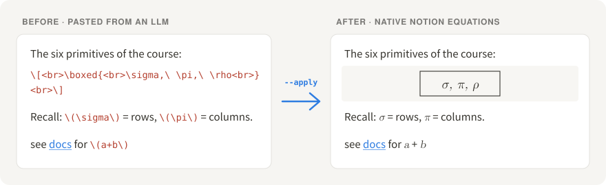

# notion-math-fixer

[](https://github.com/JeremyL691/notion-math-fixer/actions/workflows/tests.yml)   [](LICENSE)

Turn **LLM-generated LaTeX into native Notion equations** — through the official API, block by block, with an undo journal and verification.

<p align="center"></p>

ChatGPT, Claude, and most "export my chat" flows hand you `\[ ... \]`, `\( ... \)`, `<br>` tags, escaped braces and raw HTML tables. Paste that into Notion and the math stays **plain text**: you see `\[ \boxed{ \sigma, \ \pi } \]` instead of a formula. Manually re-typing every equation into `/math` blocks is not a workflow.

This tool reads an existing Notion page's **block tree**, patches only the blocks that hold literal LaTeX, and proves it worked.

```
$ python3 notion_math_fixer.py <page-id-or-url>                  # audit + plan, nothing written
$ python3 notion_math_fixer.py <page-id-or-url> --apply          # write + verify
$ python3 notion_math_fixer.py <page-id-or-url> --apply --katex  # + KaTeX gate before writing
$ python3 notion_math_fixer.py --restore <run>.journal.jsonl     # undo a run
```

---

## What it handles

| Input (what LLMs actually emit) | Output (native Notion) |
|---|---|
| `\[ ... \]` (multi-line, with `<br>` inside) | **equation block** — after a paragraph, or nested under a list item / quote / callout / toggle |
| `\( ... \)` | **inline equation** — in paragraphs, headings, lists, quotes, callouts, toggles and table cells |
| `\boxed\{ x \}`, `x_\{ij\}` (markdown-escaped argument braces) | `\boxed{ x }`, `x_{ij}` — set braces like `\{x \mid x>0\}` and `\left\{` are left alone |
| `x\_1` | `x_1` — but `\text{user\_id}` keeps its (correct) escape |
| `<br>` inside math / in prose | a newline inside the expression / in the paragraph |
| `<table><tr><td>` HTML in one or several paragraphs | **native Notion table** (cells may contain equations, `<strong>`/`<em>`/`<code>` become formatting) |

What it deliberately leaves alone: code blocks and `code`-formatted text, `$5`-style dollar signs, and prose *about* LaTeX (`use \[ ... \] for display math` — a span whose content is only `...` is documentation, not math).

## How it works

```
GET block tree ──► plan ──► dry run: print every op (+ KaTeX gate)
                     │
                     └──► --apply: write ops one by one, journal each
                              ├──► verify: re-read, re-plan must be empty
                              └──► --restore <journal>: undo, last step first
```

| block holds… | operation |
|---|---|
| only inline math | `update` — patch that block's `rich_text` in place |
| display math, in a list item / quote / callout / toggle | `update` + `insert` the equation as its first child |
| display math, in a paragraph or heading | `update` + `insert` the equation after it (`trash` the block if nothing else is left) |
| math in a table cell | `cells` — patch that row |
| a literal `<table>…</table>` | `insert` a native table, `trash` the source paragraph(s) |
| nothing to convert | nothing — it is never written |

## Safety model

* **Dry run by default.** It prints every planned operation (`before → after`); writing requires `--apply`.
* **Touches only what it must.** Inline math is fixed by patching that block's rich text in place, so links, colors, mentions, comments, children and block ids survive. Display math is inserted next to (or under) its block. Every other block is left byte-for-byte alone — callouts, toggles, images, columns, child pages included.
* **Refuses to write on a race.** If the page was edited between planning and writing, it stops.
* **KaTeX gate (`--katex`).** Every expression it is about to write is rendered with [KaTeX](https://katex.org) (`throwOnError`) *before* anything is written; one failure and nothing is written.
* **Journaled and undoable.** Each completed step is appended to `~/.cache/notion-math-fixer/<page>_<time>.journal.jsonl`; `--restore` undoes a run (or a partial run that failed midway), last step first. The full original block tree (table rows included) is saved alongside.
* **Verifies after writing** — it does not trust the `200 OK`. It re-reads the whole tree and re-plans it: a correct run leaves nothing left to convert.

```
--- verification ---
  blocks              : 27  {'heading_2': 1, 'paragraph': 11, 'equation': 4, 'table': 2, 'table_row': 5, ...}
  still convertible   : 0   (must be 0)
  equations written   : 13   (planned 13)
  text drift tokens   : 0
  RESULT              : PASS
```

## Quickstart

```bash
git clone https://github.com/JeremyL691/notion-math-fixer && cd notion-math-fixer

# 1. token: create an integration at https://www.notion.so/my-integrations
export NOTION_TOKEN=ntn_xxx        # or --token-file ~/.notion_token
# 2. share the target page with the integration (page menu → Connect to)

python3 notion_math_fixer.py "https://www.notion.so/My-Page-<id>"           # look first
python3 notion_math_fixer.py "https://www.notion.so/My-Page-<id>" --apply   # do it

# optional KaTeX gate (needs node)
npm ci && python3 notion_math_fixer.py <id> --apply --katex
```

Requires Python 3.9+ (stdlib only) and Notion-Version `2025-09-03` or newer (`--notion-version` overrides; `2026-03-11` also works).

### A real run

A test page with the constructs from [`examples/llm_note_sample.md`](examples/llm_note_sample.md), plus a nested child paragraph, a list item with a child, a callout, a link next to math and a table cell holding `\(|v|\)`:

```
--- plan ---
  16 operation(s) on 11 block(s); every other block is left untouched
    update paragraph: '记忆：\(\sigma\) 筛行，\(\pi\) 取列。' -> '记忆：$\sigma$ 筛行，$\pi$ 取列。'
    insert replacing paragraph: equation
    trash  paragraph now empty: '\[<br>\boxed\{<br>\pi_A(\sigma_C(R))<br>\}<br>\]'
    insert native table (3 rows) from HTML
    update paragraph: 'see docs for \(a+b\)' -> 'see docs for $a+b$'
    update bulleted_list_item: 'result:\[ a+b \]' -> 'result:'
    insert nested under bulleted_list_item: equation
    cells  table_row: v | $|v|$
    ...
  notes: {'unescaped argument braces \{ \}': 1, 'kept placeholder span as text (prose about math)': 2}
  KaTeX: 13/13 expressions render cleanly
```

After `--apply`: `RESULT: PASS`; a second dry run plans `0 operation(s)`; `--restore` brings the page back with identical content and order.

---

## Pitfalls this tool encodes

These are the reasons a naive "markdown → Notion" round trip silently destroys notes. Verified against the live API in October 2026.

### 1. Notion's markdown export truncates some equations — never round-trip through it

`GET /v1/pages/{id}/markdown` escapes backslashes **and silently truncates some expressions**, while the block tree holds them intact. Controlled reproduction:

| expression | block tree | markdown export |
|---|---|---|
| `\boxed{\n\pi_{authors.name}\n\left(\nauthors\n\right)\n}` | complete | **truncated to `\boxed{\n\pi_{`** |
| `\boxed{\n\omega_{authors.name}\n...\n}` | complete | **truncated to `\boxed{\n\omega_{`** |
| `\pi_{authors.name}` | complete | **truncated to `\pi_{`** |
| `\boxed{\n\pi_{authorsname}\n...\n}` (no dot) | complete | complete |
| `\boxed{\n\pi_{a.b}\n\left(x\n\right)\n}` (short) | complete | complete |

No error, no flag — `truncated: false`, `unknown_block_ids: []`. Full report + repro: [`docs/export-truncation.md`](docs/export-truncation.md). **So this tool reads `GET /v1/blocks/{id}/children` and never the export.**

### 2. …and don't write back through markdown either

An earlier version of this tool rebuilt the whole page as markdown and replaced it. That loses things no matter how careful the renderer is: links and colors (plain text only), `$5` becoming an equation, `\[` being eaten as a markdown escape, `|` in `$|x|$` splitting a table cell, children of blocks the renderer didn't know about. Patching rich text in place has none of these failure modes.

### 3. Blocks nest — a top-level walk silently drops content

A `quote` can own `paragraph` children, a paragraph can own indented children, a list item can own anything. The tree is walked recursively, table rows included. (Child pages and child databases are separate documents and are not descended into.)

### 4. Un-trashing a block does not put it back

`DELETE /v1/blocks/{id}` moves a block to the trash, but restoring it (`in_trash: false`) appends it to the **end** of its parent — and the API has no "move block". So `--restore` re-creates trashed blocks right after the sibling that preceded them (they get new ids; nothing else does).

---

## Limits

* One page per run. Batch by looping the CLI.
* A block is skipped (with a note, never half-written) if converting it would exceed Notion's limits — 100 rich-text segments per block, 1000 characters per expression — or if it contains a mention type the API cannot write back.
* A synced block that mirrors another page is not edited.
* Notion rate-limits at ~3 req/s; the client honours `Retry-After` on 429 and retries idempotent calls on 5xx/network errors.

## Development

```bash
python3 -m unittest discover -s tests -v    # stdlib only, no network
npm ci                                      # optional: enables the KaTeX gate tests
```

`tests/helpers.py` has an in-memory `FakeNotion` that mimics the block API (like Notion, it cannot move a trashed block back into place), so the planner, executor, journal and restore are exercised end to end offline.

## Prior art

Worth knowing before you pick a tool — the space is crowded, but almost all of it is UI-level:

* **Browser extensions** (the popular approach): [`voidCounter/noeqtion`](https://github.com/voidCounter/noeqtion), [`davidwkk/Notion-Equation-Converter`](https://github.com/davidwkk/Notion-Equation-Converter), [`GiulioTognetto/notion-latex-converter`](https://github.com/GiulioTognetto/notion-latex-converter), [`stanuch/NotionTeX`](https://github.com/stanuch/NotionTeX), and the "LLM to Notion – Math & LaTeX" extension.
* **Clipboard helpers**: [`Gallections/MathPaste`](https://github.com/Gallections/MathPaste), [`halilibrahimyesirci/EquaPaste`](https://github.com/halilibrahimyesirci/EquaPaste).
* **API/CLI**: [`enzo-boulin/notion-equation-converter`](https://github.com/enzo-boulin/notion-equation-converter), [`alasdairpan/mdsync`](https://github.com/alasdairpan/mdsync), [`amachino/notionx`](https://github.com/amachino/notionx).
* **Libraries**: [`tryfabric/martian`](https://github.com/tryfabric/martian), [`Cobertos/md2notion`](https://github.com/Cobertos/md2notion) — mature markdown→blocks, but they expect clean `$...$` input.

This tool's niche: **API-based, batch, eats the LLM dialect (`\[...\]`/`\(...\)`/`<br>`/HTML), and verifies instead of assuming.**

## License

MIT © 2026 Jiuyi (Jeremy) Liu
